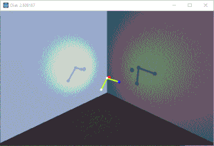

# GodotIK

Basic IK from scratch. Currently has 4 joints for 3 target variables.

Originally was written in C#, but I had to rewrite in gdscript to export to HTML5.

# References

[1] "Solving Inverse Kinematics Constraint Problems for Highly Articulated Models" by Kang Teresa Ge

[2] SVD algorithm based on https://jeremykun.com/2016/05/16/singular-value-decomposition-part-2-theorem-proof-algorithm/
